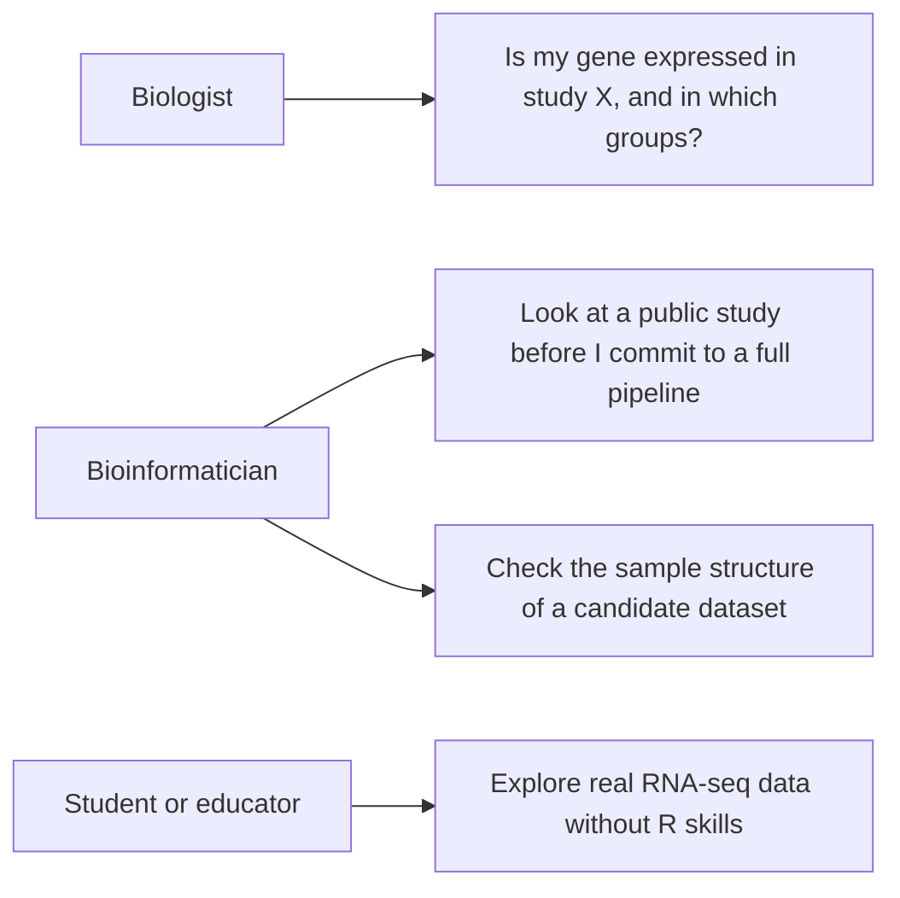
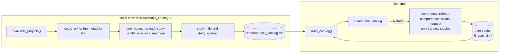
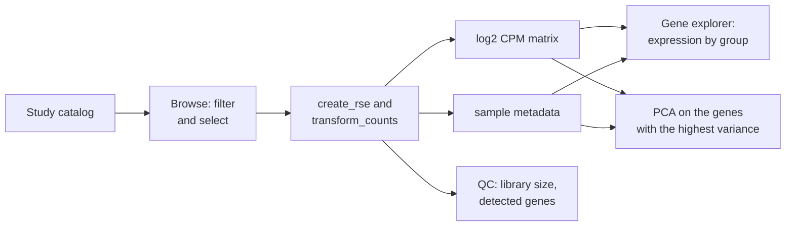
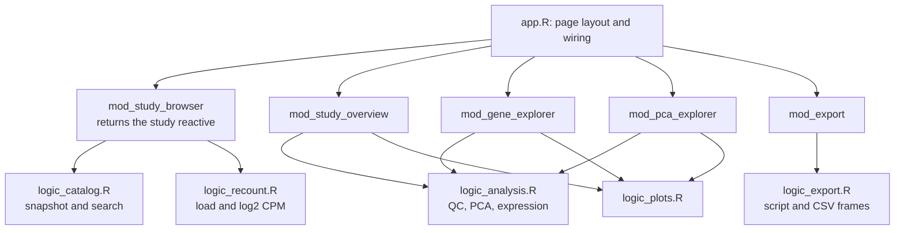

# Design

This document explains how Recount Explorer works and why it works that way.
[CONTRIBUTING.md](../CONTRIBUTING.md) covers the practical side of a change.

## Purpose

recount3 holds hundreds of thousands of RNA-seq samples for human and mouse.
One pipeline processed all of them in the same way. To read one of those
studies today, you install Bioconductor, learn the recount3 API, and write R
code.

This app removes that step. You select a study, you look at it, and you take
the data with you.



## Data source

recount3 serves gene-level counts and sample metadata for every study. The
Monorail pipeline processed all of them in the same way. The app reads recount3
through the `recount3` Bioconductor package. That package keeps a local copy of
each download through BiocFileCache. The app downloads a study one time for
each machine.

| Object | Shape | Notes |
| --- | --- | --- |
| project catalog | one row for each study | `project, organism, file_source, project_home, n_samples` |
| `rse` | RangedSummarizedExperiment, genes by samples | raw counts from `create_rse()`, scaled by `transform_counts()` |
| `log_expr` | matrix of genes by samples | log2 CPM, computed one time at load |
| sample metadata | one row for each sample | `colData(rse)`, cut down to the informative columns |

The catalog holds 18,998 studies. There are 8,882 human studies across seven
sources: sra, gtex, tcga, ANSWER_ALS, ega, LIBD, and TARGET_ALS. There are
10,116 mouse studies, all from sra.

## The catalog snapshot

`available_projects()` returns accessions and sample counts. It returns no
study title and no abstract. A catalog without titles is a list of accession
numbers that you cannot search.

The titles and the abstracts sit in a separate metadata file for each project.
Each file is a small gzipped TSV. To collect all of them the app must make
about 19,000 HTTP requests. That is a build step. It is not something to do at
run time. The official recount3 study explorer also exports the whole catalog
as CSV. The build script uses that export when it finds one. That cuts the
build from 30 minutes to 2.

The app ships a prebuilt snapshot instead:



Two properties matter here.

First, the build can resume. A job of 19,000 requests against a public server
hits failures. It must not restart from zero.

Second, the refresh will be incremental. A full rebuild takes 20 to 40
minutes. Nothing that slow belongs behind a button. The refresh reads the
accession list again. It requests titles only for studies that it never saw
before.

The refresh is not built yet. It will write the new snapshot to
`tools::R_user_dir()` rather than into the bundle. A deployed app must never
write into its own installation directory.

### Why organism and source are stored as character

`create_rse()` reaches `match.arg()` through `annotation_options()`, and
`match.arg()` rejects a factor. Storing either column as a factor breaks study
loading outright, with an error that points at recount3 rather than at the
catalog.

`catalog_proj_info()` in `R/logic_catalog.R` is the guard. It rebuilds the
selected row as plain character columns and restores the `project_type` that
the stored schema drops. Every path into `load_study()` goes through it, and a
test pins the behaviour.

## Flow



## Views

- **Browse studies**: The whole catalog, from the snapshot, with no network
  call. One search box covers the accession, the title, and the abstract text.
  Filters for organism, data source and study size sit in the left pane. When
  you select a row, the right pane shows the abstract and links out to the
  source archive.
- **Study overview**: The headline numbers, a table of the sample metadata, and
  a quality plot of library size against detected genes.
- **Gene explorer**: Server-side gene search. The app draws a boxplot or a
  violin plot of the expression. You can split the plot by any categorical
  metadata column.
- **PCA**: PC1 against PC2 on the genes with the highest variance. You can
  color the points by metadata. A bar plot shows the variance explained.
- **Export**: The RangedSummarizedExperiment (`.rds`), the log2 CPM matrix
  (`.csv.gz`), and the full sample metadata (`.csv`). The app also writes an R
  script that repeats the session. That script needs only recount3 and ggplot2.
  Its header carries the citation and the provenance. The view shows a live
  preview of the script.

## Architecture

The interface is bslib, which is Bootstrap 5 with an R API. Every part of it is
R code. A contributor can change a filter or a layout and reload, with no
JavaScript toolchain and no build step. That was a deliberate choice: this is a
tool meant for other people to use and contribute to, and most of them write R.

Three layers, and the separation does real work. It is not decoration.



`R/logic_*.R` is Shiny-free. Plain arguments go in and plain data comes out.
There is no `input$`, no `req()`, and no reactivity. This is what makes the test
suite cheap. The tests run against a 3 KB fixture with no app and no network.

It is also what made the interface replaceable. This app had a React front end
for a while, built on shinyreact. Swapping it for bslib touched `app.R` and the
modules and left all 820 lines of the logic layer and all of its tests
untouched. Keep that boundary and the next interface is equally cheap.

`R/mod_*.R` holds one module for each view. A module never reaches into another
module. The one contract between them is the `study` reactive that the browser
module returns:

```r
list(project, organism, source, rse, log_expr)   # NULL until a study loads
```

`app.R` does the wiring only.

The views and the PDF downloads share `logic_plots.R`. This is what makes a
downloaded figure match the figure on the screen.

### The browse view

Three panes: filters on the left, results in the middle, the selected study on
the right. The right pane is a bslib sidebar rather than a card under the
table, so reading an abstract never pushes the results off the screen.

Filtering happens in R through `catalog_search()`, not in DataTables. That
keeps one source of truth for what the user asked for. It also lets the
search box cover abstract text that the table never shows.

The cost of that choice is one trap. `input$catalog_rows_selected` indexes the
frame that was last rendered. When the filters change, the index can outlive
the data it referred to and resolve to a different study. The browser module
clears the selection on every filter change, which closes that window.

## What a study costs

recount3 stores one gzipped genes-by-samples file for each study. There is no
way to ask for less of it. The `sample` argument to `locate_url()` is ignored
for gene counts and returns the whole-study URL. The server does send
`Accept-Ranges: bytes`, but gzip has no row addressing, so byte ranges select
nothing useful. Only BigWig files are per sample, and those are coverage
tracks rather than counts.

So the download unit is the study. The only honest response is to say what it
costs and to refuse what exhausts the server.

| Study | Samples | Download | Memory |
| --- | --- | --- | --- |
| DRP000425 | 4 | 0.7 MB | 8 MB |
| ERP112751 | 100 | 10 MB | 194 MB |
| BRCA (TCGA) | 1,256 | 131 MB | 2.4 GB |
| BRAIN (GTEx) | 2,931 | 296 MB | 5.6 GB |
| SRP150473 (mouse) | 28,706 | 1,014 MB | 48 GB |

Downloads run at about 100 KB for each sample. Memory is the harder wall, at a
measured 30.4 bytes for each gene in each sample. A study becomes unloadable
long before it becomes slow to fetch.

The catalog records the real size of every study, taken with a HEAD request at
build time. The app shows it before anyone clicks, and the filter uses it. The
whole catalog comes to 50.3 GB. Even so, 18,323 of the 18,998 studies are
under 10 MB, and only four are over 200 MB.

The cap is 500 samples, about 1 GB of peak memory. It allows 18,760 studies,
98.7 percent of the catalog. It stops the 238 that put a server under real
pressure. `RECOUNT_EXPLORER_MAX_SAMPLES` moves it.

The refusal carries the numbers. A message that says "too large" and stops
there tells the reader nothing about what to do next. The pane names the
sample count, the limit, the download, the memory, and the variable that
raises it. The server checks the limit as well as the interface, because hiding a
button stops nobody.

### Prefetching

About 70 percent of a cold load is download. A warm load is 3 to 4 seconds
whatever the study size, so anything already in BiocFileCache loads quickly.

`prefetch_study_files()` fetches exactly what `create_rse()` needs: the
metadata files, the shared annotation and the counts file. It runs in three
places. The app warms the shared annotation at startup, 1.8 MB for each
organism, which takes a step off every first load. It warms the selected study
while the reader is on its abstract. It cancels the previous warm-up first, so
clicking through a page of results does not queue a download for every row.
And `data-raw/prefetch_studies.R` warms a chosen set before a demo.

Prefetching has its own mirai pool with a single worker. Warming a study
somebody is only reading about can never take a slot from a study they asked
for. A load stops any warm-up first, so the two never write BiocFileCache at
the same time.

### Making the size pass affordable

Recording 19,000 sizes looked like a four hour job. Two measurements changed
that. `locate_url()` costs 0.39 seconds a study. The documented `http://`
address answers with a 301 to `https://`, which answers with a 302 to S3. Each
HEAD therefore cost about 0.9 seconds.

The build resolves that redirect once and learns the storage prefix from it.
It learns the annotation code from one `locate_url()` call for each organism.
It then builds the rest of the URLs itself. That is 0.06 seconds a study, and the whole
pass takes about four minutes.

Neither shortcut is written down. Both are learned at run time, so they follow
recount3 if it moves. `verify_fast_urls()` checks the constructed URLs against
`locate_url()` for every organism and source before the pass starts. If
they disagree the build falls back to the slow path rather than recording
19,000 wrong numbers.

## Startup cost

The main process must not load recount3.

`requireNamespace("recount3")` takes 5.3 seconds and loads 98 namespaces.
Calling it on the browse path put that cost on every session. It was 42
percent of the time from process start to the first visible row.

Browsing needs none of it. The catalog is a local file, and `create_rse()`
runs on a mirai daemon in its own process, where loading recount3 is both
wanted and free. So `app.R` asks `recount3_installed()`, which reads
`system.file()` and never loads anything. `recount3_available()` still exists
for the daemon side.

Measured: 12.6 s to the first row before, 7.4 s after, 44 namespaces instead
of 98. A test in `tests/testthat/test-logic_recount.R` runs the check in a
clean subprocess and asserts recount3 stays unloaded.

## Concurrency

A study download takes seconds or several minutes. On the main R process that
download freezes the app for every connected user. It does not freeze the app
only for the user who clicked.

The load therefore runs on mirai daemons through `ExtendedTask`. mirai
evaluates the code in a clean process. Nothing is attached in that process.
This is why the functions in `logic_recount.R` write `recount3::` and
`SummarizedExperiment::` in front of every call.

The catalog refresh runs on the same machinery.

## Testing

The tests sit in `tests/testthat/`. They cover the logic layer only. They run
against `tests/testthat/fixtures/rse_small.rds`. That fixture holds 200 genes
and 12 samples.

The `colData` of the fixture is difficult on purpose. It holds a constant
column, an all-NA column, a list column, and a column with one level for each
sample. Those four cases are the reason that `metadata_table()` and
`metadata_group_choices()` exist. They are the cases worth a test.

No test uses the network. If a test needs data from the recount3 servers, put a
fixture in `tests/testthat/fixtures/` instead.

## Future work

- GTEx studies and TCGA studies are slow to load and they need a lot of memory.
  Add a sample limit or disk-backed storage before the app shows them first.
- Differential expression between two metadata groups.
- A heatmap of the genes with the highest variance.
- A deployment target.
