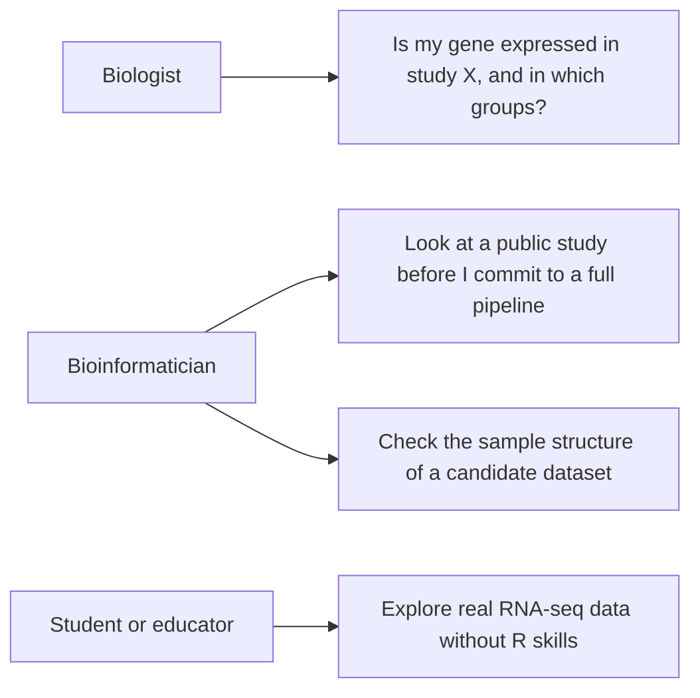
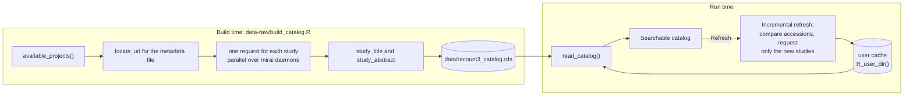
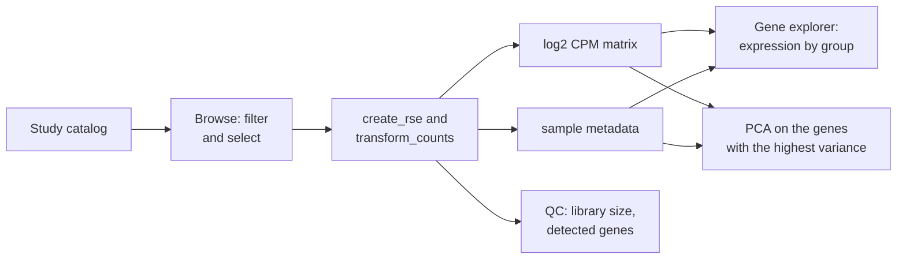
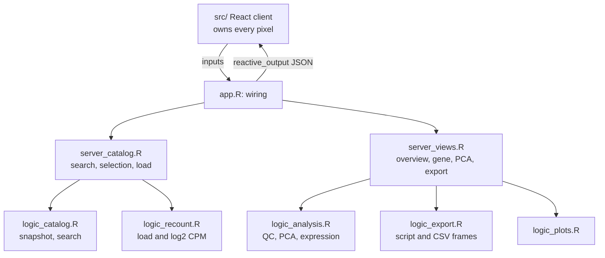

# Design

This document explains how Recount Explorer works and why it works that way.
[CONTRIBUTING.md](../CONTRIBUTING.md) covers the practical side of a change.

## Purpose

recount3 holds hundreds of thousands of RNA-seq samples for human and mouse.
One pipeline processed all of them in the same way. To read one of those
studies today, you install Bioconductor, learn the recount3 API, and write R
code.

This app removes that step. You select a study, you look at it, and you take
the data with you.



## Data source

recount3 serves gene-level counts and sample metadata for every study. The
Monorail pipeline processed all of them in the same way. The app reads recount3
through the `recount3` Bioconductor package. That package keeps a local copy of
each download through BiocFileCache. The app downloads a study one time for
each machine.

| Object | Shape | Notes |
| --- | --- | --- |
| project catalog | one row for each study | `project, organism, file_source, project_home, n_samples` |
| `rse` | RangedSummarizedExperiment, genes by samples | raw counts from `create_rse()`, scaled by `transform_counts()` |
| `log_expr` | matrix of genes by samples | log2 CPM, computed one time at load |
| sample metadata | one row for each sample | `colData(rse)`, cut down to the informative columns |

The catalog holds 18,998 studies. There are 8,882 human studies across seven
sources: sra, gtex, tcga, ANSWER_ALS, ega, LIBD, and TARGET_ALS. There are
10,116 mouse studies, all from sra.

## The catalog snapshot

`available_projects()` returns accessions and sample counts. It returns no
study title and no abstract. A catalog without titles is a list of accession
numbers that you cannot search.

The titles and the abstracts sit in a separate metadata file for each project.
Each file is a small gzipped TSV. To collect all of them the app must make
about 19,000 HTTP requests. That is a build step. It is not something to do at
run time. The official recount3 study explorer also exports the whole catalog
as CSV. The build script uses that export when it finds one. That cuts the
build from 30 minutes to 2.

The app ships a prebuilt snapshot instead:



Two properties matter here.

First, the build can resume. A job of 19,000 requests against a public server
hits failures. It must not restart from zero.

Second, the refresh will be incremental. A full rebuild takes 20 to 40
minutes. Nothing that slow belongs behind a button. The refresh reads the
accession list again. It requests titles only for studies that it never saw
before.

The refresh is not built yet. It will write the new snapshot to
`tools::R_user_dir()` rather than into the bundle. A deployed app must never
write into its own installation directory.

### Why the table binds the whole catalog

The browser hands the entire catalog to `DT::datatable()` and lets DataTables
do the filtering. That looks wasteful and is not.

`input$catalog_rows_selected` is an index into the frame given to
`datatable()`, before sorting and before search. So the index survives any
amount of sorting and filtering, as long as that frame does not change. The
earlier code rebuilt a filtered frame on every control change. That let the
selection input lag one flush behind the data and point at the wrong study.

The abstract column stays in the data and is hidden through `columnDefs`.
DataTables treats visible and searchable as independent, so a search still
matches abstract text. Removing the column instead breaks the table outright.
The server-side filter compares the client column count against `ncol(data)`
and returns nothing when the two disagree.

`organism` and `file_source` are rendered as factors so DataTables draws a
select box rather than a text box. They are stored as character, because
`create_rse()` rejects a factor, and selection resolves against storage.

## Flow



## Views

- **Browse studies**: The whole catalog, from the snapshot, with no network
  call. One search box covers the accession, the title, and the abstract text.
  Each column has its own filter. When you select a row, the app shows the
  abstract and links out to the source archive.
- **Study overview**: The headline numbers, a table of the sample metadata, and
  a quality plot of library size against detected genes.
- **Gene explorer**: Server-side gene search. The app draws a boxplot or a
  violin plot of the expression. You can split the plot by any categorical
  metadata column.
- **PCA**: PC1 against PC2 on the genes with the highest variance. You can
  color the points by metadata. A bar plot shows the variance explained.
- **Export**: The RangedSummarizedExperiment (`.rds`), the log2 CPM matrix
  (`.csv.gz`), and the full sample metadata (`.csv`). The app also writes an R
  script that repeats the session. That script needs only recount3 and ggplot2.
  Its header carries the citation and the provenance. The view shows a live
  preview of the script.

## Architecture

The interface is React. The R process holds reactive logic only. shinyreact
serves a built bundle out of `www/`. It gives the client hooks that read Shiny
inputs and outputs. There is no Shiny UI object anywhere in this app.

Three layers, and the separation does real work. It is not decoration.



`R/logic_*.R` is Shiny-free. Plain arguments go in and plain data comes out.
There is no `input$`, no `req()`, and no reactivity. This is what makes the
test suite cheap. The tests run against a 3 KB fixture with no app and no
network.

`R/server_*.R` holds the reactive logic and builds no interface. The one
contract between its two halves is the `study` reactive that the catalog half
returns:

```r
list(project, organism, source, rse, log_expr)   # NULL until a study loads
```

`app.R` does the wiring only.

The views and the PDF downloads share `logic_plots.R`. This is what makes a
downloaded figure match the figure on the screen.

### Why the plots stay on the server

A React client can draw the charts itself. For a histogram that is the better
answer. These are not histograms. A PCA scatter with a colour legend
and a boxplot with jittered points already exist in `logic_plots.R`, and the
same builders produce the downloaded PDF. Redrawing them in the browser means
writing each chart twice and then keeping the two copies identical.

So ggplot2 renders, `renderPlot` ships the image, and the client mounts it. The
client asks for a plot by giving a div the `shiny-plot-output` class, which is
how Shiny finds it. `shinyreact::ShinyOutput` renders that element and calls
`Shiny.bindAll` on its parent. The same trick carries the download links, which
are anchors with the `shiny-download-link` class.

### Two shapes that bite

Both of these produce a blank page with no server error, so they are worth
naming.

**React has to come from `window.shinyreact`.** The hooks live in the React
instance the shinyreact runtime owns. Importing React from `node_modules`
instead loads a second copy, the components read one dispatcher while the hooks
write the other, and every `useState` throws. The build externalizes React. The JSX
also runs in classic mode. The automatic JSX runtime imports
`react/jsx-runtime` and pulls that second copy back in.

**Shiny serializes a data frame column wise.** A client expecting an array of
rows gets one object of parallel arrays, and `.map()` throws. Anything the
client iterates goes through `df_to_rows()` first. For the same reason a
length-1 vector is wrapped in `I()`, since Shiny unboxes it into a bare scalar.

## Startup cost

The main process must not load recount3.

`requireNamespace("recount3")` takes 5.3 seconds and loads 98 namespaces.
Calling it on the browse path put that cost on every session. It was 42
percent of the time from process start to the first visible row.

Browsing needs none of it. The catalog is a local file, and `create_rse()`
runs on a mirai daemon in its own process, where loading recount3 is both
wanted and free. So `app.R` asks `recount3_installed()`, which reads
`system.file()` and never loads anything. `recount3_available()` still exists
for the daemon side.

Measured: 12.6 s to the first row before, 7.4 s after, 44 namespaces instead
of 98. A test in `tests/testthat/test-logic_recount.R` runs the check in a
clean subprocess and asserts recount3 stays unloaded.

## Concurrency

A study download takes seconds or several minutes. On the main R process that
download freezes the app for every connected user. It does not freeze the app
only for the user who clicked.

The load therefore runs on mirai daemons through `ExtendedTask`. mirai
evaluates the code in a clean process. Nothing is attached in that process.
This is why the functions in `logic_recount.R` write `recount3::` and
`SummarizedExperiment::` in front of every call.

The catalog refresh runs on the same machinery.

## Testing

The tests sit in `tests/testthat/`. They cover the logic layer only. They run
against `tests/testthat/fixtures/rse_small.rds`. That fixture holds 200 genes
and 12 samples.

The `colData` of the fixture is difficult on purpose. It holds a constant
column, an all-NA column, a list column, and a column with one level for each
sample. Those four cases are the reason that `metadata_table()` and
`metadata_group_choices()` exist. They are the cases worth a test.

No test uses the network. If a test needs data from the recount3 servers, put a
fixture in `tests/testthat/fixtures/` instead.

## Future work

- GTEx studies and TCGA studies are slow to load and they need a lot of memory.
  Add a sample limit or disk-backed storage before the app shows them first.
- Differential expression between two metadata groups.
- A heatmap of the genes with the highest variance.
- A deployment target.
