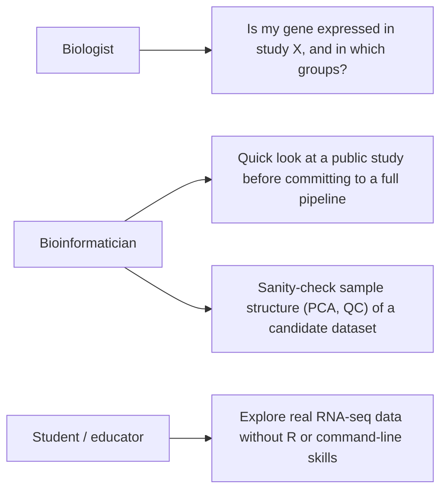
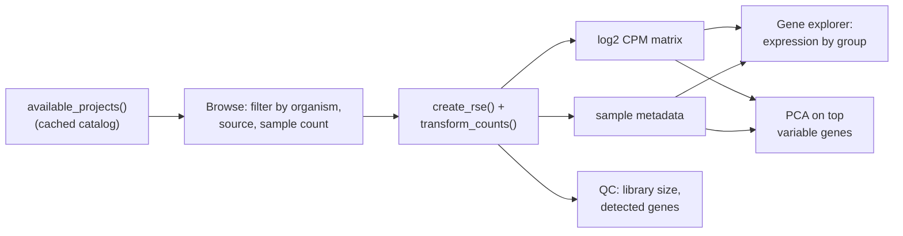
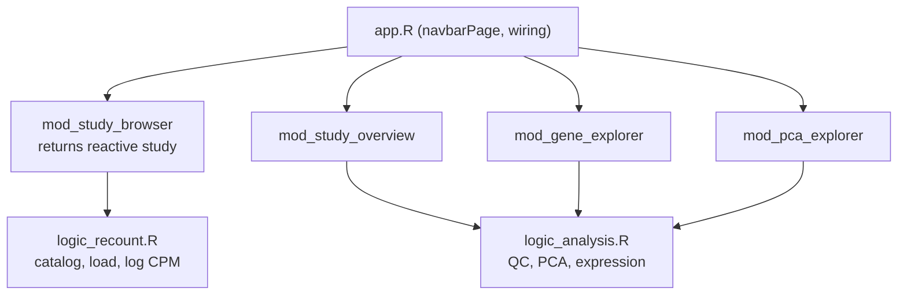

# Recount Explorer

Browse the [recount3](https://bioconductor.org/packages/recount3/) catalog of
uniformly processed RNA-seq studies (hundreds of thousands of human and mouse
samples from SRA, GTEx, and TCGA) and visualize any study without writing code.
Pick a study, and the app pulls it through the recount3 API and gives you
metadata, QC, gene-level expression, and PCA views.

**Status:** implemented through phase 2: scaffold, async study loading
(ExtendedTask + mirai), and exports (data downloads, plot PDFs, reproducible
script).

## Who uses it, and why

## Data source

recount3 serves gene-level counts and rich sample metadata for every study,
uniformly processed with the Monorail pipeline. The app talks to it through the
`recount3` Bioconductor package, which caches downloads locally via
BiocFileCache, so a study is only downloaded once per machine.

| Object | Shape | Notes |
| --- | --- | --- |
| project catalog | one row per study | `project, organism, file_source, project_home, n_samples` |
| `rse` | RangedSummarizedExperiment, genes x samples | raw counts from `create_rse()`, scaled with `transform_counts()` |
| `log_expr` | genes x samples matrix | log2 CPM, computed once at load time |
| sample metadata | one row per sample | `colData(rse)`, curated to informative columns |

## Flow

## Views

- **Browse studies**: filterable table of the recount3 catalog (organism, data
  source, minimum sample count), select a row and load it.
- **Study overview**: stat tiles (study, samples, genes, source), curated
  sample metadata table, library size vs detected genes QC scatter.
- **Gene explorer**: server-side gene search, expression boxplot or violin
  split by any categorical metadata column.
- **PCA**: PC1 vs PC2 on the top N variable genes, colored by metadata, with a
  variance-explained scree bar.
- **Export**: RSE (.rds), log2 CPM matrix (.csv.gz), full flattened sample
  metadata (.csv), exact on-screen plots as PDF, and a standalone reproduction
  script (recount3 + ggplot2 only) with citation and provenance in its header,
  previewed live in the tab.

## Architecture

Same layering as the lifescience-shiny-gallery apps: the app layer
([app.R](../../app.R)) is page layout and module wiring only, compute lives in
a Shiny-free logic layer, and each view is a module. The UI is classic Shiny
(no bslib) with a small bespoke stylesheet (www/app.css), like the
signature-scoring showcase app.

The `study` reactive returned by the browser module is the single data
contract between modules: `list(project, organism, source, rse, log_expr)`,
`NULL` until a study is loaded.

Study loading (download plus log2 CPM) runs off the main process on mirai
daemons via `ExtendedTask`, so one user's slow download never freezes the app
for anyone. The gene and PCA modules return their current settings as
reactives; the export module feeds those into the reproduction-script builder,
and the shared plot builders in `logic_plots.R` guarantee the downloaded PDFs
match the on-screen plots exactly.

## Future work

- Large studies (GTEx, TCGA) are slow to load and memory-heavy: add a sample
  cap or on-disk (arrow/HDF5) backing before exposing them prominently.
- Differential expression between two metadata groups (reuse the gallery's
  group-comparison component).
- Heatmap of top variable genes (reuse the gallery's heatmap component).
- renv lockfile, logic-layer tests (testthat on a fixture RSE), CI.
- Deploy target and `_brand.yml` to match the showcase branding.
